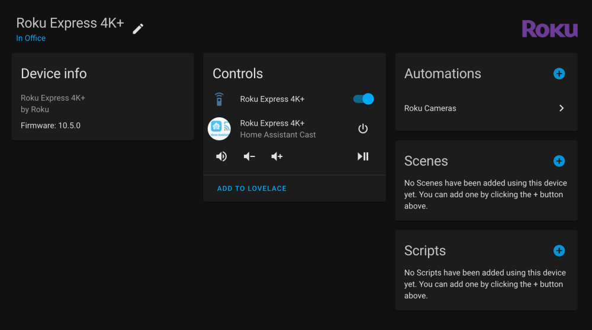

# Roku Media Player

_Custom component that extends Home Assistant Roku integration allowing to use the media player with deep links._

**This component will set up the following platforms.**

Platform | Description
-- | --
`media_player` | Allows stream cameras and media content to Roku.
`remote` | Allows you to send remote control buttons to a Roku device.



## Installation

1. Using the tool of choice open the directory (folder) for your HA configuration (where you find `configuration.yaml`).
2. If you do not have a `custom_components` directory (folder) there, you need to create it.
3. In the `custom_components` directory (folder) create a new folder called `roku`.
4. Download _all_ the files from the `custom_components/roku/` directory (folder) in this repository.
5. Place the files you downloaded in the HA `config/custom_components` directory (folder).
6. Restart Home Assistant
7. In the HA UI go to "Configuration" -> "Integrations" click "+" and search for "Roku"

Using your HA configuration directory (folder) as a starting point you should now also have this:

```text
custom_components/roku/translations/*.json
custom_components/roku/__init__.py
custom_components/roku/browse_media.py
custom_components/roku/config_flow.py
custom_components/roku/const.py
custom_components/roku/coordinator.py
custom_components/roku/entity.py
custom_components/roku/manifest.json
custom_components/roku/media_player.py
custom_components/roku/remote.py
custom_components/roku/services.yaml
custom_components/roku/strings.json
```

## Configuration

The configuration of you Roku devices is exactly as the native HA core component, you can find the details on the component documentation page: https://www.home-assistant.io/integrations/roku/

## Media Player Improvements

The changes introduced by this custom component are focused on improving the `media_player` platform support for Roku. In addition to the usage described on the documentation linked above this component supports two new ways of interacting with Roku.

### Streaming a specific content on Roku apps

Using the `appID` for the channel and a `contentId` you can tell Roku to start an app running a specific video. In order to get the `appID` of the channel you can just open the URL `http://ROKU_IP:8060/query/apps` in your web browser of choice. The Roku will return an XML-formatted list of available channels, including their full name and appID.

More details can be found on the [Roku dev pages](https://developer.roku.com/docs/developer-program/debugging/external-control-api.md)

Check some Examples below of how to automate the startup of different Roku apps with content:

#### YouTube Video

To start this _YouTube Fireplace video_ (`https://www.youtube.com/watch?v=6VB4bgiB0yA`) automatically on your Roku, you just need use the following action:

- Replace the `entity_id` with your device
- YouTube `appId` is `837` and the `contentId` (YouTube video code) separated by a comma
- The `media_content_type` set as `app`

```yaml
action:
  - service: media_player.play_media
    target:
      entity_id: media_player.roku_express_4k
    data:
      media_content_id: 837,6VB4bgiB0yA
      media_content_type: app
```

#### Hulu Episode

```yaml
action:
  - service: media_player.play_media
    target:
      entity_id: media_player.roku_express_4k
    data:
      media_content_id: 2285,american-dad-977c8e25-cde0-41b7-80ce-e746f2d2093f
      media_content_type: app
```

#### Spotify Playlist

```yaml
action:
  - service: media_player.play_media
    target:
      entity_id: media_player.roku_express_4k
    data:
      media_content_id: 22297,spotify:playlist:5xddIVAtLrZKtt4YGLM1SQ
      media_content_type: app
```

#### Spotify Track

```yaml
action:
  - service: media_player.play_media
    target:
      entity_id: media_player.roku_express_4k
    data:
      media_content_id: 22297,spotify:track:67awxiNHNyjMXhVgsHuIrs
      media_content_type: app
```

### Streaming HA camera to Roku

With this custom component and its Roku companion app you now can stream a camera to your Roku device, just like is done using `Google Cast` integration.

First you need to make sure you have the [Roku Home Assistant Cast App](https://github.com/lvcabral/ha-roku-cast-app) side loaded to your Roku device (see the instructions on the [app repository]((https://github.com/lvcabral/ha-roku-cast-app)), then you can add the action below to any of your automations (make sure you replace the entities id with the ones from your HA instance).

```yaml
action:
  - service: camera.play_stream
    target:
      entity_id:
        - camera.floodlight_camera
    data:
      media_player: media_player.roku_express_4k
      format: hls
```

## Contributions

If you want to contribute to this please read the [Contribution guidelines](CONTRIBUTING.md)

## License

Copyright (C) 2022 Marcelo Lv Cabral. All rights reserved.

Licensed under [MIT](LICENSE) License.
